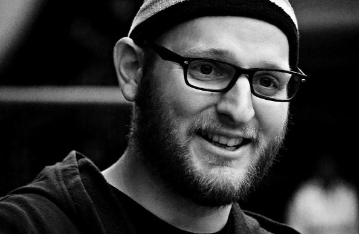

Mark J. Hill is Lecturer in Cultural Computation in the Department of Digital Humanities at King’s College London. His interdisciplinary research encompasses digital humanities, computational social science, intellectual history, and cultural analytics. He was formerly Lecturer in Computational Social Science at the University of Kent, as well as having held academic positions at the University of Helsinki and the London School of Economics. He has a DPhil from Brasenose College at the University of Oxford, an MSc from the London School of Economics, and BA from Concordia University, Montreal, Canada.

His research sits at the intersection of digital methodologies and traditional scholarly inquiry. Interests include social network analysis, public discourse analysis through large-scale datasets, quantitative text analysis, and critical examinations of digital research methodologies. His work maintains a dual focus on the advancement of substantive research topics and the development of digital methods. Current research involves the examination of patterns in discourse and idea transmission across historical and contemporary contexts focusing on the role of language within social networks and cultural systems. 

## View my 

* [CV](CV.md)
* [Faculty profile](https://www.kcl.ac.uk/people/mark-j.-hill)
* ORCID: [0000-0001-7273-1775](https://orcid.org/0000-0001-7273-1775)
* Google Scholar: [Mark J. Hill](https://scholar.google.com/citations?user=y4Vjeb0AAAAJ&hl=en)
* Bluesky: [mrak.bsky.social](https://bsky.app/profile/mrak.bsky.social)
* Github: [markjhill](https://github.com/markjhill)

## Recent work/outputs/events:

### 2025 

* PUB and TALK: "Catching Stray Balls: Football, fandom, and the impact on digital discourse." at [Association for Computational Linguistics 2025, 9th Workshop on Online Abuse and Harms (WOAH)](https://aclanthology.org/2025.woah-1.17/). 1 August 2025. Winner of Best Theme Paper.
* TALK: "Ultras, trolls and normies: football events, digital fandom, and public discourse" at [International Association for Media and Communication Research 2025](https://iamcr.org/singapore2025). 17 July 2025. (Presented by colleague and co-investigator [Rafal Zaborowski](https://www.kcl.ac.uk/people/rafal-zaborowski)).
* TALK: "Case studies using HPC in Digital Humanities Research" at [Digital Humanities & Research Software Engineering Summer School 2025](https://dhrse2025.er.kcl.ac.uk/). 2 July 2025.
* PREPRINT: "Catching Stray Balls: Football, fandom, and the impact on digital discourse." DOI: [10.48550/arXiv.2506.01642](https://doi.org/10.48550/arXiv.2506.01642)
* PUB: "Book Formats, Printing Practices and Reading Habits in Early Modern Europe" in *Library Catalogues as Data: Research, Practice and Usage*. URL: [https://www.facetpublishing.co.uk/page/detail/library-catalogues-as-data/?k=9781783306589](https://www.facetpublishing.co.uk/page/detail/library-catalogues-as-data/?k=9781783306589)

### Older

* For older outputs see my CV, ORCID, or Google Scholar page.
